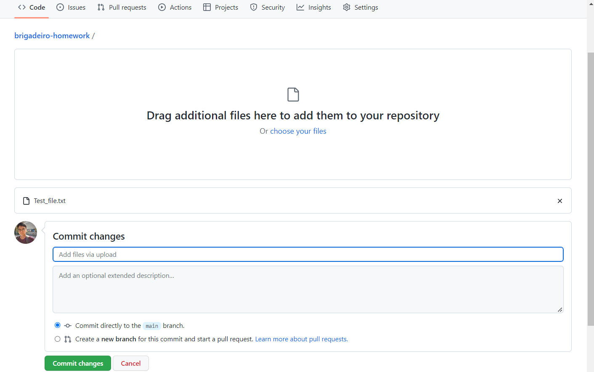
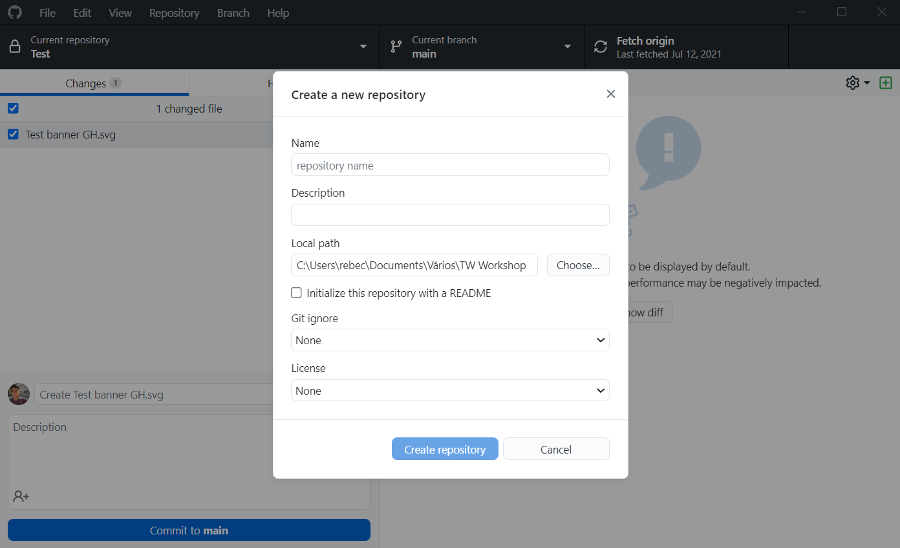

# How to add files to a GitHub repository

One of the great things about GitHub repositories is that they not only monitor updates to specific content, but they also work on the folder level, listening to additions or removals of whole files.

In this article, you will see two simple methods to add files to a GitHub repository.

### Method 1: on the website 

If you are dealing with a repo that you rarely ever need to update, or if it only contains a few files, this might be a good option for you:

#### Prerequisites 

1. Log in to GitHub.
2. Have a repository in your account.

#### Add files on the GitHub website 

1. Access the repository homepage.
2. Go to **Add file** > **Upload files**GitHub redirects you to an upload page.\

3. Select the files in one of the following ways:\

   *   Open a file explorer window on your computer and drag the items to the GitHub page.

       or
   * Click **choose your files**, find the file(s) in the pop-up window and click **Open** to confirm.\

1. Edit the default commit summary line and add an extended description according to your needs.
2. Select **Commit changes** to confirm.

The GitHub repository is updated with the files you have added.\

NOTE: By default, your commit will be added to the main branch of your repository. GitHub also gives the option of creating a new branch instead. You can learn more about it in the article about how to work with branches.

### Method 2: using a GUI git management tool 

When you have several people working on the same project or when changes to the folder structure are constant, the best option is to have your local folder and the GitHub repository clone one another.

This means that your local version of the project is constantly monitored and Git will automatically take account of any changes, making it easy for you to update the repository with them.

Although this process can sound complex at first, it is not that difficult to work with, especially if you use a Graphical User Interface (GUI) tool, such as GitHub for desktop.

#### Prerequisites 

1. Install GitHub for desktop.
2. Make sure you are signed in to the correct GitHub account. To confirm, access **File** > **Options** > **Accounts**
3. Set up the repository considering one of the following scenarios:

* If you have the project folder set up on your machine

1. Go to **File** > **New repository**
2. Fill in the repository **Name**, add a **Description** as needed and choose a local path. The local path describes where the project folder is located on your computer.

It is also possible to create a README file for your repository and you can browse through different **Git ignore** and **License** options.

1. Select **Create repository** to confirm.

A new repository is created on your GitHub account, based on your local folder.

* If the project repository exists on GitHub but not yet on your machine

1. Go **File** > **Clone repository**
2. Choose from a list of your repositories.
3. Choose a local path where the clone should be created.
4. Select **Clone** to confirm.

A new local folder is created on your machine, based on the repository in your GitHub account.

Once the repository exists both locally (in your machine) and remotely (on GitHub), whenever you add, remove or modify a file, GitHub for desktop will be able to recognise and list those changes. This way you can send it to the remote and make your committed work available to other collaborators of the repository.

#### Add files using GitHub for Desktop 

1. On the top left corner of GitHub for desktop, go to **Current repository** and make sure you are looking at the folder you have been working on.
2. Select the tab **Changes** and check the modifications you have saved on your machine.

.png>)

GitHub for desktop indicates added files with a “+” icon next to them.

1. Write a summary and add a description to your commit.
2. Select **Commit to \<current repo branch>** and then **Push to origin** to confirm

The GitHub repository is updated with the files you have added.
