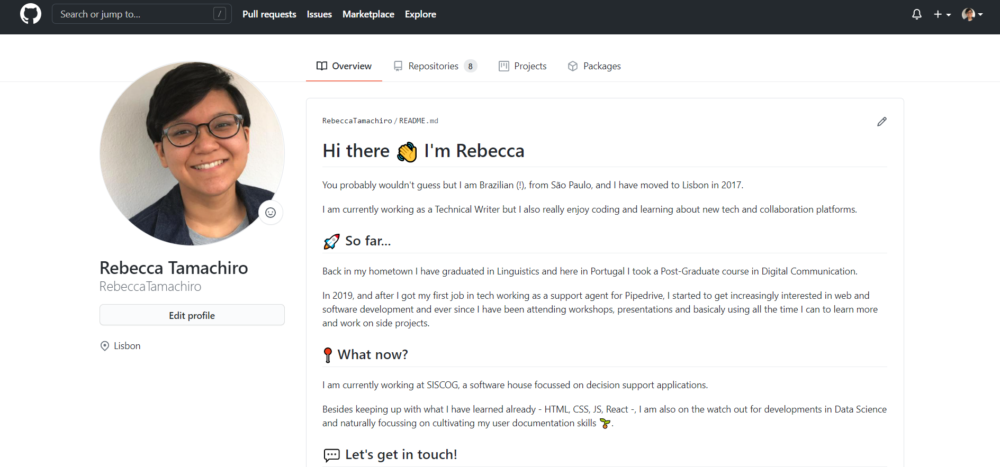
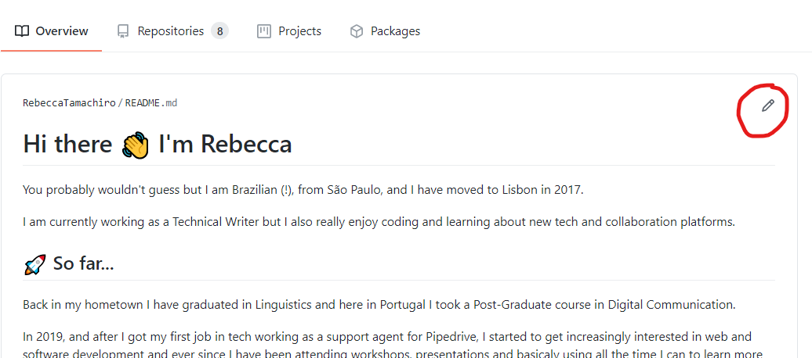
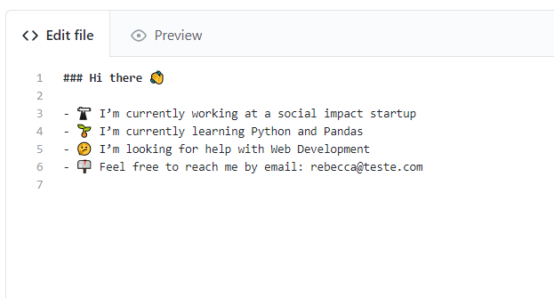

# Get started with your personal repository

In this tutorial, you will learn how to create a personal GitHub repository and use it to display a cool profile README.

### Requirements 

1. Create a GitHub account.
2. Log in to GitHub website.

### Setting up the personal repository 

1. Select the dropdown menu **+** on the top right corner of any GitHub page.
2. Select **New Repository**.\
   GitHub displays a new page where you should provide the basic settings for your repo:
   - Use the same name that appears under **Owner** as the **Repository name**.
   <figure><figcaption></figcaption></figure>
   - Do not worry about the **Description** for now.
   <figure><figcaption></figcaption></figure>
   - Make sure you have **Public** selected.
   - Enable the **Add a README file** option.
3. Select **Create repository** to confirm.\
   Your personal repository is created and GitHub redirects you to its specific homepage.\

Whenever the personal repository is set to “public”, its README is also displayed on your GitHub profile.

To check it out, go to the main dropdown menu on the right corner of GitHub’s navigation bar and select **Your profile**.

### Editing the GitHub profile README 

To edit the content, select the pencil icon on the right upper corner of the README section.

<figure><figcaption></figcaption></figure>

GitHub opens an editor with two different tabs: **Edit file** and **Preview**.

Write your content using [GitHub Markdown language](https://docs.github.com/get-started/writing-on-github/getting-started-with-writing-and-formatting-on-github/basic-writing-and-formatting-syntax) on the **Edit file** tab, and inspect how it is displayed on the **Preview** tab.

Because the GitHub profile uses Markdown language, notice that whatever is next to # is a heading and that whatever is between \<!-- -- > is on the editor but is not displayed.

Check the guide linked above if you would like to learn more about Markdown. For now, let's stick to the suggested template and use it to add content to your profile:

1. Delete the GitHub introductory paragraph, starting at \<!-- and until the first item of the list you want to display.
2. Fill next to the emojis with information about yourself, erasing the items that are not interesting for you. For example:

   

   - Also, make sure you delete the -- > notation at the end of the list to make it cleaner.

3. Scroll down the page and commit your changes. You can use the default options that are already selected.\

And that is it! Your customized profile README is ready!
